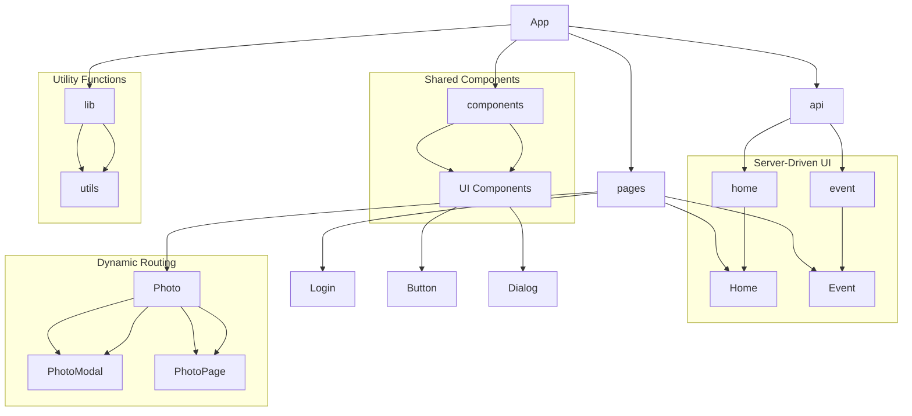
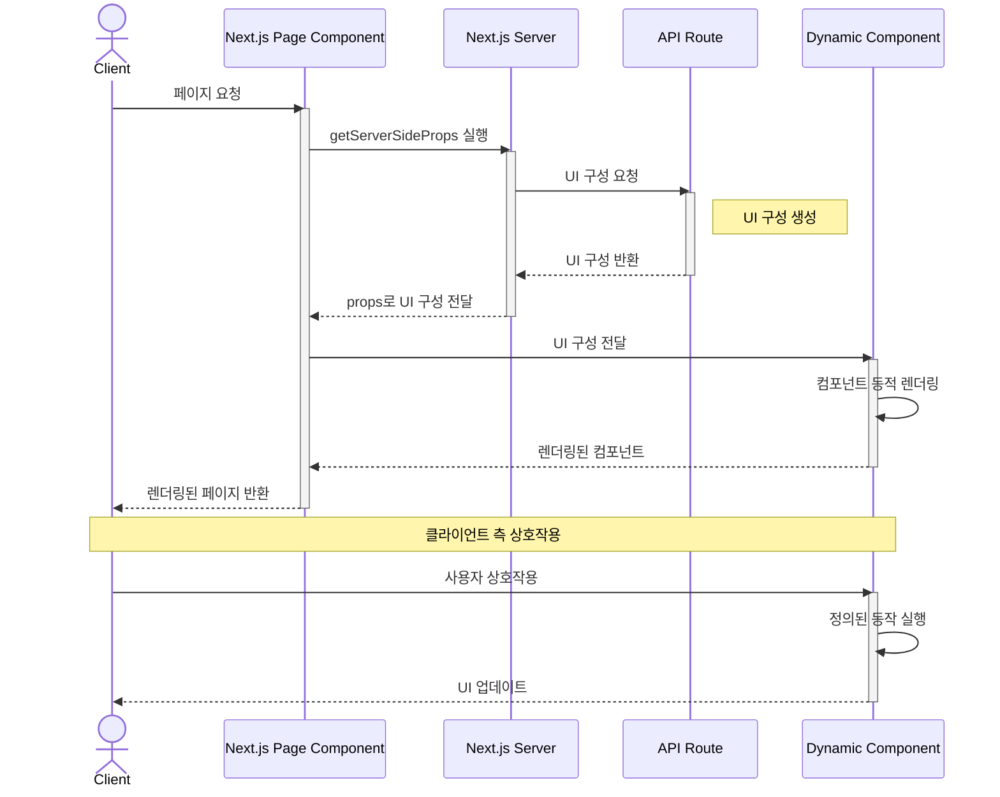

# 서버 드리븐 UI 예시 프로젝트

이 프로젝트는 서버 드리븐 UI (Server-Driven UI) 개념을 구현한 Next.js 웹페이지 입니다. 서버에서 동적으로 UI 구성을 결정하고, 클라이언트에서 이를 렌더링하는 방식을 보여줍니다.

## 주요 기능

- 서버에서 동적으로 UI 구성 생성
- 클라이언트에서 동적 컴포넌트 렌더링

## 기술 스택

- Next.js 14.2.15
- React 18
- TypeScript
- Tailwind CSS
- ESLint

## 프로젝트 구조

- `src/app/page.tsx`: 메인 페이지 컴포넌트
- `src/app/api/home/route.ts`: UI 구성을 제공하는 API 라우트
- `src/app/event/page.tsx`: 이벤트 페이지 컴포넌트
- `src/app/api/event/route.ts`: 이벤트 페이지 UI 구성을 제공하는 API 라우트

## 사용 방법

서버에서 정의된 UI 구성에 따라 동적으로 컴포넌트가 렌더링됩니다.

- Header
- Text
- Button
- Table
- Image

## 페이지

1. 홈 페이지 (`/`): 기본 서버 드리븐 UI 예시
2. 이벤트 페이지 (`/event`): 이벤트 페이지 예시

## Server-driven UI

